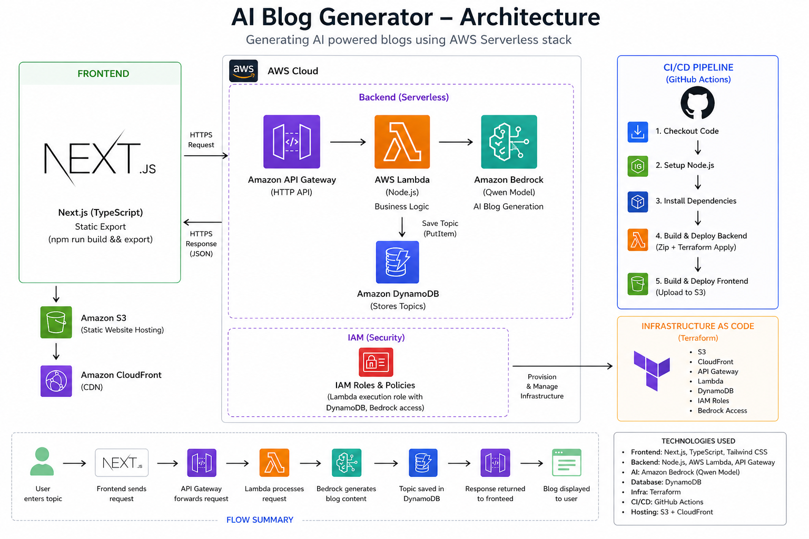

# AI Blog Generator (AWS Serverless + Terraform + CI/CD)

A full-stack serverless AI blog generation platform built using **AWS, Terraform, Bedrock, Lambda, API Gateway, DynamoDB, and Next.js**, with full CI/CD using GitHub Actions.



---

## Tech Stack

### Frontend
- Next.js
- TypeScript
- Tailwind CSS
- S3 - cloudfront hosting

### Backend
- AWS Lambda
- API Gateway (HTTP API)
- Node.js (TypeScript)
- AWS SDK v3

### AI
- Amazon Bedrock (Qwen model)

### Infrastructure
- Terraform (Infrastructure as Code)

### Database
- DynamoDB (stores topics)

### CI/CD
- GitHub Actions

---

## Features

- Generate AI blog posts from a topic
- 200–300 word SEO-friendly blogs
- JSON structured output
- Stores blog topics in DynamoDB
- Fully serverless backend
- Infrastructure managed with Terraform
- Automatic deployment via GitHub Actions
- Global CDN via CloudFront

---

##  Project Structure

```

backend/
├── src/
│   └── index.ts
├── terraform/
│   └── main.tf
frontend/
├── src/
├── app/
├── public/
.github/
└── workflows/
└── deploy.yml
